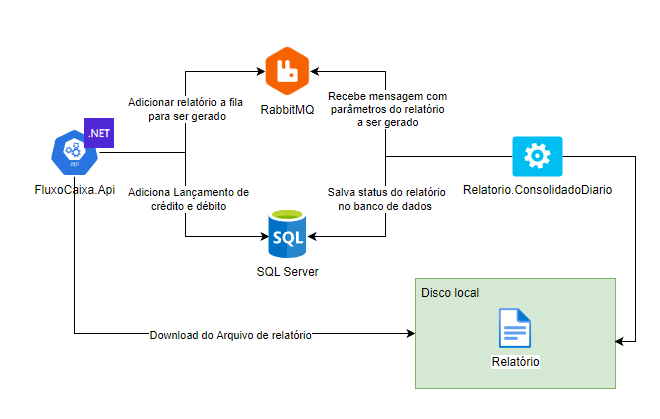

# FluxoCaixa.Api

`
Aplicação para controle de fluxo de caixa e processamento de relatório.
`

## Tecnologias utilizadas

`
O backend foi contruído utilizando .NET na versão 6, por ser a última versão LTS lançada. Utilizei SQL Server 2019 como banco de dados devido a sua robustez como banco relacional. Utilizei o RabbitMQ para gereciamento da fila de processamento de relatório.
`


## Solução




Lançamentos
  - A aplicação consiste em uma API para controlar o fluxo de caixa,      adicionado lançamentos de crédito e débito, atualizando assim o saldo no caixa.

Relatórios
  - A aplicação também gera um relatório do consolidado diário, que fica disponível para download, no formato CSV, após o seu processamento.
  Cada solicitação de relatório requerida, é enviada a um tópico no RabbitMQ, para ser processado por um Worker Service.

## Arquitetura


Foram utilizados conceitos de Arquitetura Limpa e Ports And Adapters para a contrução do projeto.
Também foram trabalhados os conceitos de SOLID, DRY, KISS e YAGNI.

## Domínio


O Domínio contém agregações, com entidades ricas, facilitando o gerenciamento de dados e evolução do projeto.

## Design do código


## Executando o projeto

- Execute o seguinte comando para rodar os containers da aplicação.
```
docker-compose up -d
```

- Com o comando `docker-compose ps` você pode verificar se todos containers estão sendo executados.

- Para abrir o swagger da api no navegador, acesse o [link](http://127.0.0.1:8001/swagger/index.html).
